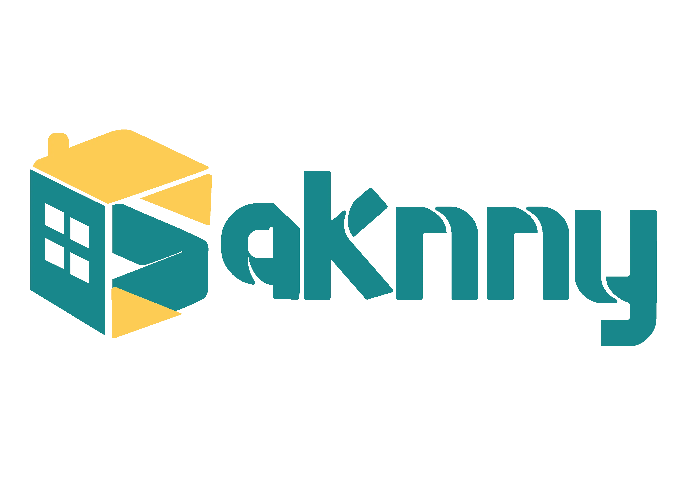

# 🌍 Saknny

<p align="center">
  
</p>

Welcome to **Saknny**, a modern and responsive web platform for **apartment and bed management**, featuring a landing page and dedicated dashboards for providers and admins.

> 🚀 Built with **React + Vite** — Fast, modular, and developer-friendly.

---

## ⚙️ Tech Stack

### 🧑‍💻 **Languages**

- 🟨 JavaScript (ES6+)
- 🌐 HTML5
- 🎨 SCSS

### 📚 **Libraries & Frameworks**

- ⚛️ [React](https://react.dev/) – Frontend Framework
- ⚡ [Vite](https://vitejs.dev/) – Next-gen build tool
- 🔀 [React Router](https://reactrouter.com/) – SPA routing
- 🌐 [Axios](https://axios-http.com/) – HTTP requests
- 🅱️ [Bootstrap](https://getbootstrap.com/) – Responsive UI components
- 🧩 [Material UI](https://mui.com/) – Rich React UI framework
- 📊 [Recharts](https://recharts.org/) – Data visualization
- 🔔 [React Toastify](https://fkhadra.github.io/react-toastify/) – Toast notifications

---

## 📦 Installation

To get started with the project:

```bash
git clone https://github.com/your-username/saknny.git
cd saknny
npm install
```

---

## 🧪 Running the Project

Launch the development server:

```bash
npm run dev
```

Visit the app in your browser at:  
🔗 [http://localhost:5173](http://localhost:5173)

---

## 📁 Project Structure

```
src/
├── assets/         → Images, logos, icons
├── components/     → Reusable UI components (Navbar, Sidebar, Cards, etc.)
├── pages/          → Application pages (Landing, Dashboard, Requests, etc.)
├── context/        → Global state (Login, Theme Mode)
├── App.jsx         → Main application component
└── main.jsx        → Vite entry point
```

---

## 🎨 Themes Support

- ☀️ **Light Mode** – Clean and bright interface
- 🌙 **Dark Mode** – Elegant dark UI

---

## 📸 Screenshots

> Example:  
> 

---

## 📬 Contact & Contributions

Have suggestions, issues, or ideas?  
Feel free to open an issue or submit a pull request 💬  
You can also contact the team at: `support@saknny.app`

---

> © 2025 Saknny. All rights reserved.
